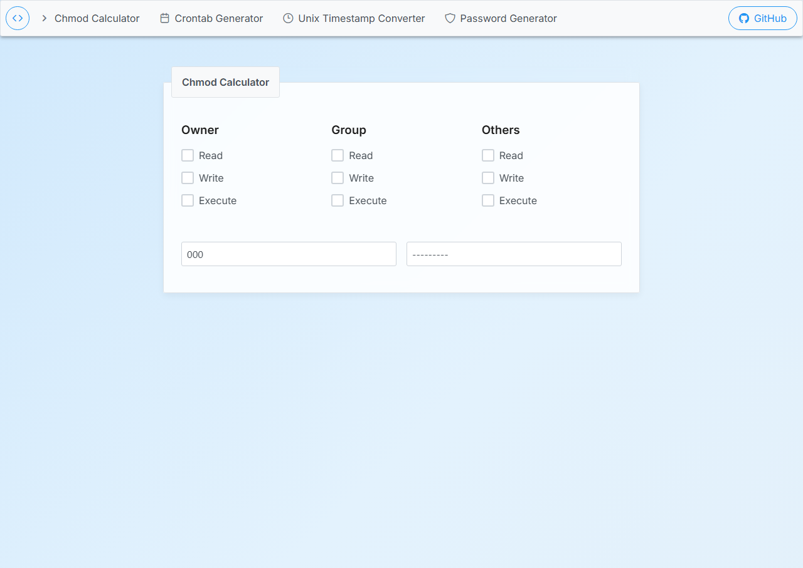

# Web Developer Tools

A modern, responsive collection of essential developer tools built with React, TypeScript, and Redux. This application provides a suite of utilities commonly used by developers in their daily work.

## Features

- **Modern UI**: Clean, responsive design with animated gradient background
- **Chmod Calculator**: Convert between numeric, symbolic, and checkbox representations of Unix file permissions
- **Crontab Generator**: Create cron job schedules with an intuitive interface
- **Unix Timestamp Converter**: Convert between Unix timestamps and human-readable dates
- **Password Generator**: Generate secure passwords with customizable options
- **Responsive Design**: Works on desktop, tablet, and mobile devices
- **No Server Required**: All calculations happen in the browser

## Tools Overview

### Chmod Calculator
Easily convert between different representations of Unix file permissions:
- Checkbox interface for intuitive permission setting
- Numeric input (e.g., 755)
- Symbolic notation (e.g., rwxr-xr-x)

### Crontab Generator
Create cron job schedules without memorizing the syntax:
- Intuitive scheduling options for minutes, hours, days, months, and weekdays
- Generate crontab lines with custom commands
- Output handling options

### Unix Timestamp Converter
Convert between Unix timestamps and human-readable dates:
- Convert dates to timestamps
- Convert timestamps to dates
- Support for local time and GMT

### Password Generator
Generate secure passwords with customizable options:
- Adjustable password length
- Options for uppercase, lowercase, numbers, and symbols
- Copy to clipboard functionality

## Technology Stack

- **React** with **TypeScript** for a robust frontend
- **Redux** with **Redux Toolkit** for state management
- **PrimeReact** components for a consistent UI
- **PrimeFlex** for responsive layout utilities
- **React Router** for client-side routing

## Available Scripts

In the project directory, you can run:

### `yarn start`

Runs the app in development mode. Open [http://localhost:3000](http://localhost:3000) to view it in the browser. The page will reload if you make edits, and you will see any lint errors in the console.

### `yarn test`

Launches the test runner in interactive watch mode.

### `yarn build`

Builds the app for production to the `build` folder. It correctly bundles React in production mode and optimizes the build for the best performance. The build is minified and filenames include hashes.

### `yarn deploy`

Deploys the app to GitHub Pages.

## UI Enhancements

The application features a modern, clean design with:
- Animated gradient background with 20-second smooth transition
- Responsive layout that works on all device sizes
- Consistent black (#1e1e1e) heading colors
- Modern font stack with Inter and Fira Code
- Card-based design with subtle shadows and rounded corners
- Improved button and input styling

## Browser Support

- Chrome (latest)
- Firefox (latest)
- Safari (latest)
- Edge (latest)

## Contributing

Contributions are welcome! Feel free to submit a pull request or open an issue.

## Acknowledgments

- Built with [Create React App](https://github.com/facebook/create-react-app)
- UI components from [PrimeReact](https://www.primefaces.org/primereact/)
- Icons from [PrimeIcons](https://www.primefaces.org/primeicons/)
